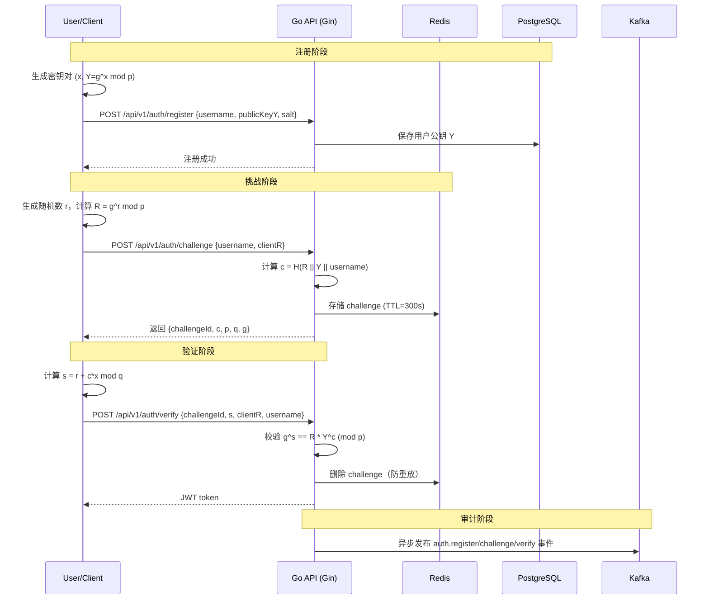
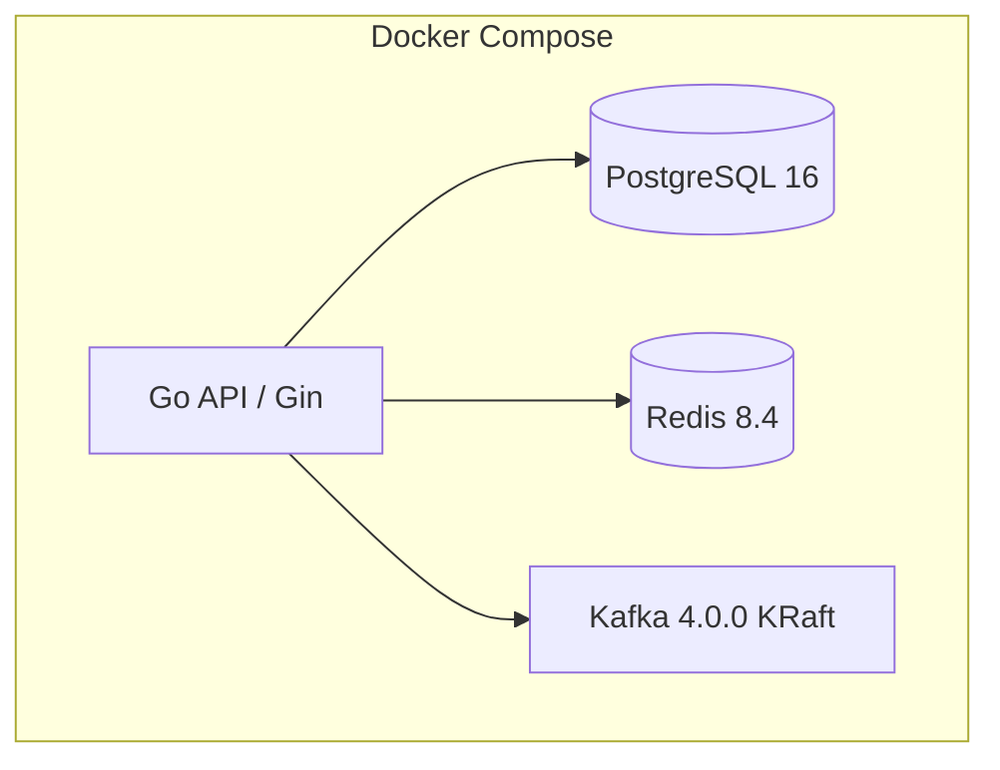

# ZKP Auth System (Go) | 零知识证明身份验证系统

[](https://go.dev/)
[](https://gin-gonic.com/)
[](https://www.postgresql.org/)
[](https://kafka.apache.org/)
[](https://en.wikipedia.org/wiki/Schnorr_signature)

> 本项目是对上游项目 [Arisgod1/Zkp_rkp](https://github.com/Arisgod1/Zkp_rkp) 的 Go 版复刻，是作者用来学习go的特性的项目。当前版本已完成核心功能与工程化能力落地，可稳定运行完整认证链路。

---

## 最终状态

- 复刻目标完成：核心 ZKP 认证链路已全量实现。
- 工程化完成：配置化、限流、中间件、日志、审计发布、容器化部署均已打通。
- 运行形态完成：支持本地运行和 Docker Compose 一键启动。
- 测试能力完成：提供可循环执行的 e2e/perf 双模式客户端脚本。

---

## 核心特性

- 零知识认证：基于 Schnorr 协议，服务端只存公钥，不接触私钥。
- 防重放：Challenge 存 Redis，带 TTL，验证后立即删除。
- 多层限流：令牌桶（平滑突发）+ 滑动窗口（严格总量），均基于 Redis。
- 异步审计：Kafka 审计事件发布，支持 `Noop -> Kafka + Async` 按配置切换。
- 优雅退出：服务停止时关闭 HTTP、DB、Redis、审计发布器资源。
- 一键压测：`zkp_e2e` 提供 `e2e`（真实链路）与 `perf`（轻计算）两种模式。

---

## 系统架构

### 认证流程（Schnorr Protocol）



### 基础设施拓扑



---

## 技术栈

| 组件 | 版本 | 用途 |
|------|------|------|
| Go | 1.26.1 | 应用运行时 |
| Gin | 1.12.0 | HTTP 框架 |
| GORM + pgx | gorm 1.31.1 / pg driver 1.6.0 | PostgreSQL 访问 |
| Redis Client | go-redis v9.18.0 | Challenge 与限流 |
| Kafka Client | kafka-go v0.4.50 | 审计事件发布 |
| JWT | golang-jwt/jwt v5.3.1 | 令牌签发与鉴权 |
| Viper | v1.21.0 | 配置加载 |
| Zap | v1.27.1 | 结构化日志 |

---

## 快速开始

### 环境要求

- Docker Engine + Docker Compose
- Go 1.26.1（本地运行/开发）
- PowerShell（运行 `zkp_e2e/run.ps1`）

### 1) 启动完整服务栈

```bash
docker compose up -d --build
docker compose ps
```

### 2) 运行真实链路自测（e2e）

```powershell
./zkp_e2e/run.ps1 -Mode e2e -Count 5
```

### 3) 运行性能模式（perf）

```powershell
./zkp_e2e/run.ps1 -Mode perf -Count 50 -IntervalMs 10
```

### 4) 查看审计消息

```bash
docker exec -it zkp_kafka /opt/kafka/bin/kafka-console-consumer.sh \
	--bootstrap-server localhost:9092 \
	--topic zkp.audit \
	--from-beginning
```

---

## API 概览

- `POST /api/v1/auth/register`
	- 请求：`username`, `publicKeyY`, `salt`
- `POST /api/v1/auth/challenge`
	- 请求：`username`, `clientR`
	- 响应：`challengeId`, `c`, `p`, `q`, `g`
- `POST /api/v1/auth/verify`
	- 请求：`challengeId`, `s`, `clientR`, `username`
	- 响应：`token`, `type`, `expiresIn`
- `GET /api/v1/me`
	- Header：`Authorization: Bearer <token>`

---

## 限流策略

每个认证接口都使用两层限流：

- 第一层（Token Bucket）：快速拒绝短时突发，减少后端压力。
- 第二层（Sliding Window）：控制固定窗口总量，保证分钟级上限。

默认示例（可配置）：

- `bucket_capacity: 50`
- `bucket_refill_per_sec: 10`
- `register/challenge/verify_per_minute: 60`

当窗口层拒绝时会执行令牌桶补偿，避免无效扣减导致误伤。

统一错误响应：当命中限流时，HTTP 状态码为 `429`，错误码为 `COMMON_RATE_LIMITED`，并返回统一结构 `code/message/requestId`。

---

## 密码学映射

| 数学符号 | 含义 | 项目字段 |
|---------|------|---------|
| p | 1536-bit safe prime | challenge 响应中的 `p` |
| q | (p-1)/2 | challenge 响应中的 `q` |
| g | 生成元 | challenge 响应中的 `g` |
| x | 私钥 | 客户端保管，不上传 |
| Y | 公钥 | `publicKeyY` |
| R | 承诺值 | `clientR` |
| c | 挑战值 | `c = H(R || Y || username)` |
| s | 证明值 | `s = r + c*x mod q` |

验证方程：

$$
g^s \stackrel{?}{=} R \cdot Y^c \pmod p
$$

---

## 项目结构

```text
zkp_rkp_go/
├── cmd/server/main.go
├── internal/
│   ├── audit/                 # 审计发布（noop/kafka/async）
│   ├── auth/                  # JWT 相关
│   ├── controller/            # HTTP 控制器
│   ├── middleware/            # 请求ID/日志/限流/鉴权
│   ├── model/                 # DTO 与实体
│   ├── repository/            # 数据访问层
│   └── service/               # ZKP 业务编排
├── pkg/
│   ├── config/                # 配置加载
│   ├── errs/                  # 错误码映射
│   ├── logger/                # 日志初始化
│   └── response/              # 统一响应工具
├── zkp_e2e/                   # 客户端测试与压测脚本
├── application.yaml
├── docker-compose.yml
└── Dockerfile
```

---

## 性能测试（实测）

测试时间：2026-04-08  
测试方式：`zkp_e2e/run.ps1`

### perf 模式基准

- `Summary: total=20 success=20 failed=0 elapsed=15.90s success_rps=1.26`

### 真实链路基准（e2e）

- `Summary: total=50 success=50 failed=0 elapsed=39.04s success_rps=1.28`

结论：在当前环境下，两种模式吞吐接近，瓶颈主要在服务端 I/O 链路（DB/Redis/Kafka）而非脚本本地计算。

---

## 总结

该仓库已完成对上游 `Zkp_rkp` 的 Go 版复刻，并实现从协议流程到容器化运行、异步审计、自动化自测/压测的闭环，当前状态可作为后续扩展与性能优化的稳定基线。
